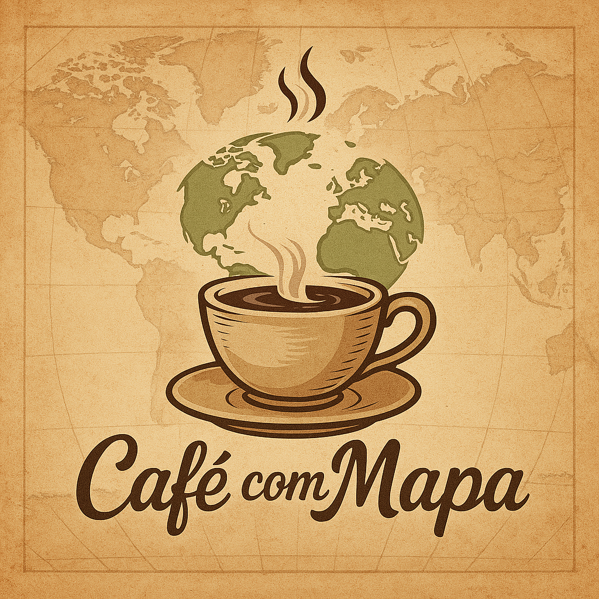

Nossas paixões em palavras.

Nos conhecemos há mais de 20 anos, quando a vida ainda estava desenhando os primeiros rascunhos do que viria a ser essa parceria de alma. Já fomos colegas, amigos, pares de aventuras e agora, enfim, um casal que compartilha não só a vida, mas também a vontade de explorar o mundo — juntos.

Antes mesmo de termos um "nós" oficial, já dividíamos caminhos, ideias e planos. O "Café com Mapa" nasce dessa história vivida lado a lado, feita de viagens cheias de significados, conversas sem pressa, sabores que contam histórias, e reflexões que a vida insiste em nos trazer. Aqui, falamos de experiências — não só as nossas, mas as que talvez também sejam suas.

Este espaço é sobre descobrir o mundo com o olhar de quem vive o cotidiano, mas não abre mão da curiosidade. Vamos compartilhar roteiros e destinos, falar de comida boa (sem frescura), tecnologia na vida real (para quem usa, não para quem programa), e pensamentos soltos que nos atravessam ao longo do caminho.

Seja bem-vindo ao nosso blog. Puxe uma cadeira, prepare seu café e venha com a gente — o mapa já está na mesa.

