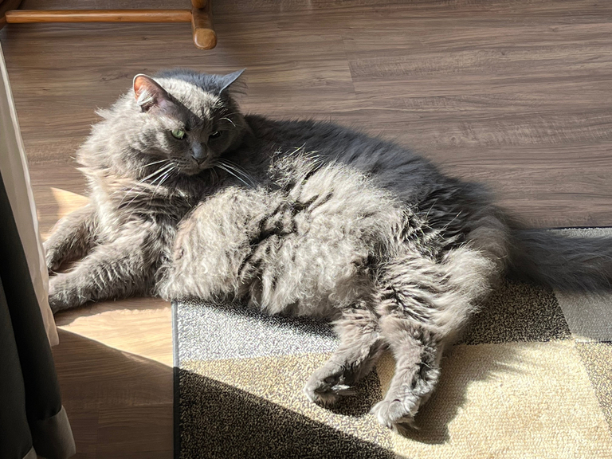

Na curta caminhada desta noite, me ocorreu um pensamento incitado por uma foto que tirei hoje no trabalho. Lembrei que meu filho não concordava com o nome com o qual batizei minha gata, a qual ele chama, na maioria das vezes, de “gata” ou “gatinha”.

Por que não nomear seres que amaremos tanto com nomes que gostamos?

Daí comecei a lembrar do porquê gosto tanto do nome daquela felina que habita lá em casa. Pensei nisso porque a Amanda, a da cobrança, afirma que batizei a gata em homenagem a ela, apesar de conhecê-la há dois anos e de a gata ter quase três. Até entendo a semelhança do jeito atrevido e da língua felina que as duas compartilham. Conheço outras homônimas, e cada uma delas possui características que também encontro naquela bola de pelo que se esgueira pelas paredes do apartamento. O largo sorriso da Amanda que trabalhava na interceptação, a simpatia da Amanda, analista operacional, a astúcia daquela que é gerente de comunicação. Se procurar, encontrarei incontáveis características que poderia associar às inúmeras Amandas que já conheci.

A Amanda que enche a minha casa de pelo não é santa. Ela é charmosa, delicada, rápida, precisa, silenciosa, mas também brava e irritadiça, traiçoeira e vingativa.

Poderia afirmar que escolhi este nome porque os nomes de meus filhos começam com “A”, ou por causa da “Amandinha”, que na verdade chama Erika.

Poderia ser por causa de um codinome que guardo na minha agenda ou de uma lembrança do passado que hoje se manifesta, ronronando, miando ou trazendo brinquedos quando requer minha atenção.

O fato é que sua atitude selvagem, com sua postura de quem patrulha o espaço aéreo da casa, protegendo dos invasores voadores que adentram pela janela, contrasta com seu jeito carinhoso de quando quer um afago, um mimo ou até mesmo um petisco.

Não sei se existe uma regra para batizar qualquer ser vivo que seja. Prefiro acreditar que a Amanda é uma homenagem a todas as Amandas que conheço e que, de certa forma, acabei por transformar a todas em “gatas”.

incrível!

